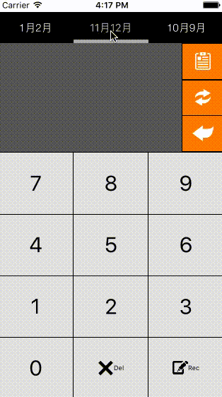
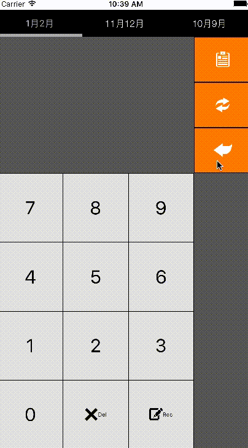

# Job-apply-IOSApp

## Objective
此專案為給面試官作為參考用途,使用前請記得重新安裝cocapod，相關lib名稱請參考podFile

## Describe
此專案為一個快速輸入並記錄紙本發票後三碼的IOS App，以一個TabViewController為RootController包三個不同月份ViewController，以滑動方式或點選月份來決定記錄的月份，輸入完成後以plist做存取，根據iphone機型做動態版面變化，並設計有左右移動鍵盤方便單手操作

